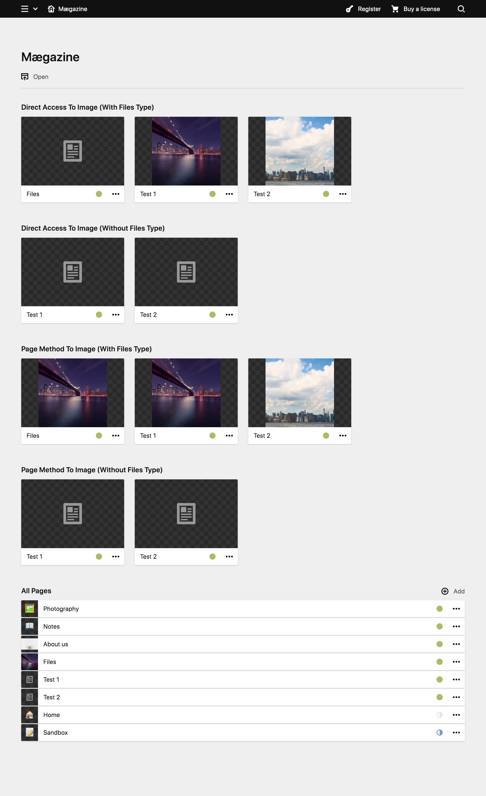

# Notes

Forked from https://github.com/getkirby/starterkit, this repository is created to demonstrate a minimal working example of a potential bug in the Kirby CMS. For the related forum page, please visit https://forum.getkirby.com/t/page-image-is-not-displayed-in-pages-section-when-referencing-a-filtered-out-page/25352.

# Test

Use the local php server to start the code: `composer run start`

The panel user is already created, use `test@test.com` as the user and `testtest` as the password.

# Screenshot of the panel

